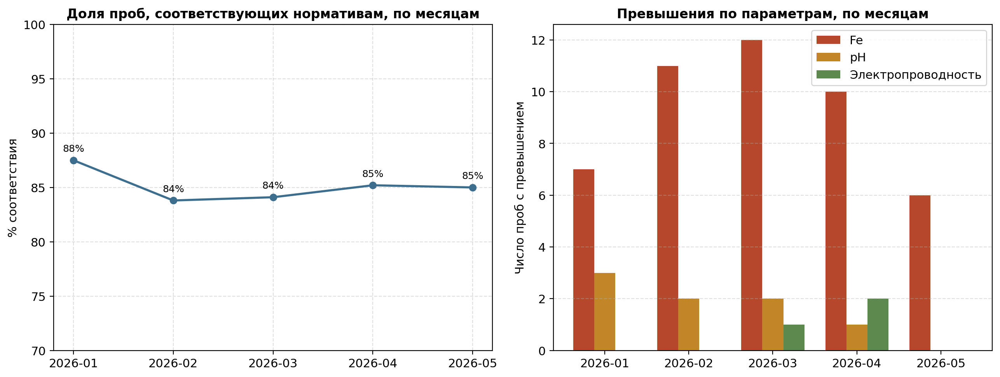
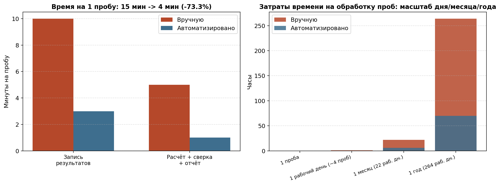

# Автоматизация системы контроля качества

Бизнес-кейс из практики в химико-аналитической лаборатории: перевод
ручного журнала анализов (расчёт показателей, сверка с нормативами,
составление отчёта - всё вручную и на бумаге) в автоматизированную
Excel-систему с единым сводом результатов, автоматическим статусом
"норма/превышение" по каждой пробе воды (проще говоря - анализа) и дашбордом по месяцам.

> **О данных.** Исходные результаты измерений лаборатории защищены коммерческой
> тайной и не публикуются. Датасет в этом репозитории - синтетический (т.е. искусственно сгенерированный, имитирует структуру и паттерны реальных результатов), но
> воспроизводит реальную структуру процесса (несколько параметров на пробу, регулярные анализы на протяжении месяцев)
> и реальную логику автоматизации, которая использовалась в работе.



## Проблема

Раньше на занесение результатов анализа каждой пробы (концентрация железа, pH, электропроводность и
т.д.) уходило до **15 минут ручной работы**: сначала запись результатов
измерений в бумажный журнал (≈10 мин), затем расчёт показателей на бумаге с использованием калькулятора, и сверка с нормативами для составления
итогового отчёта (≈5 мин). При десятках проб в день это превращалось в
существенную часть рабочего времени лаборанта - время, которое можно
было бы потратить на сами анализы или иные задачи, а не на их оформление.

## Решение

Настроила Excel-систему, где:
- результаты измерений удобно вносятся в один лист-форму;
- концентрация, и прохождение по нормативу по каждому параметру (норма/превышение/недостаток) и итоговый статус пробы считаются **автоматически по
  формулам** - без ручного пересчёта, где возможны ошибки как человеческий фактор;
- всё сразу попадает в общую визуализацию: свод с датой, номером пробы и статусом -
  не нужно вести отдельные журналы и переносить результаты между листами;
- добавлен дашборд: доля проб, прошедших контроль, по месяцам и
  разбивка превышений по параметрам - раньше такой картины по времени не существовало и все данные искались отдельно в журналах.

## Результат

**Время на расчёт одного анализа + занесение в отчёт: 15 мин -> ~4 мин (-73%)**



| Время | Вручную | Автоматизировано | Экономия |
|---|---|---|---|
| 1 проба | 15 мин | 4 мин | 11 мин |
| 1 рабочий день (~4 анализа) | 1.0 ч | 0.3 ч | 0.7 ч |
| 1 месяц (22 рабочих дня) | 22 ч | 5.9 ч | 16.1 ч |
| 1 год (264 рабочих дня) | 264 ч | 70 ч | **194 ч** |

Автоматизация, помимо выигрыша экономии во времени, убрала ручной перенос цифр между
листами (частая причина ошибок), избавила от бумажных журналов и
дала возможность быстро смотреть тренд по месяцам, а не поднимать
архив вручную при каждом вопросе о качестве проб за
период.

*Оценки времени по этапам условные, расчёт масштабирования
делается автоматически в `src/time_savings_analysis.py`.*

## Структура репозитория

```
water-qc-automation/
├── data/
│   └── raw_measurements.csv        # синтетический журнал измерений
├── src/
│   ├── generate_data.py            # генерация синтетического датасета
│   ├── build_excel.py              # сборка Excel-системы из данных
│   ├── time_savings_analysis.py    # количественная оценка экономии времени
│   └── dashboard_preview.py        # превью дашборда для README
├── excel/
│   └── qc_workbook.xlsx            # готовая Excel-система с формулами, лабораторный журнал
├── results/
│   ├── dashboard_overview.png
│   ├── time_savings.png
│   ├── time_breakdown.csv
│   └── time_scale.csv
├── requirements.txt
└── README.md
```

## Как устроена Excel-система (`excel/qc_workbook.xlsx`)

- **`Нормативы`** — справочник допустимых значений (Fe - по СанПиН
  1.2.3685-21, pH - по СанПиН, электропроводность - внутренний
  технологический норматив лаборатории).
- **`Градуировка_Fe`** — коэффициенты пересчёта сигнала в концентрацию
  (перенесены из отдельного кейса калибровки, см.
  [metal-calibration-analytics](https://github.com/<ваш-логин>/metal-calibration-analytics)).
- **`Данные_ввод`** — сырой ввод измерений (то, что раньше писали в
  журнал вручную).
- **`Результаты`** — автосвод: концентрация Fe и статус по каждому
  параметру считаются формулами (`IF`, `AND`), итоговый статус пробы —
  одной формулой, с условным форматированием (зелёный/красный).
- **`Дашборд`** — помесячная сводка (`COUNTIF`/`COUNTIFS`) и два
  встроенных графика (тренд доли соответствия, превышения по
  параметрам) - пересчитывается сам при добавлении новых проб.

## Как запустить

```bash
git clone <ваш-репозиторий>
cd water-qc-automation
pip install -r requirements.txt

python src/generate_data.py            # генерирует data/raw_measurements.csv
python src/build_excel.py              # собирает excel/qc_workbook.xlsx
python src/time_savings_analysis.py    # считает экономию времени + график
python src/dashboard_preview.py        # строит превью дашборда для README
```

## Стек

`Excel` (IF/AND, COUNTIF/COUNTIFS, условное форматирование, встроенные
графики) · `Python` (pandas, matplotlib, openpyxl) · автоматизация
процесса и построение отчётности · количественная оценка эффекта
(time & motion study).

## Лицензия

[MIT](LICENSE)
